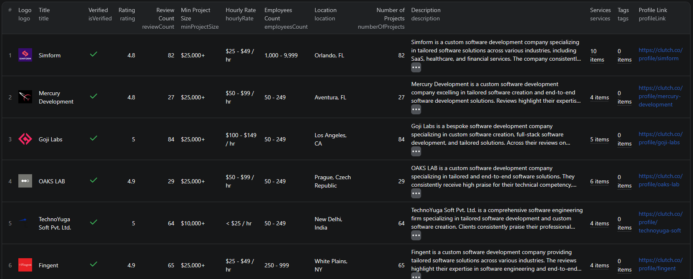

# How to Scrape Clutch.co Listings in Node.js

This example shows how to scrape Clutch.co company listings in Node.js using the [Clutch Listings Scraper](https://apify.com/piotrv1001/clutch-listings-scraper) actor on Apify — no browser automation or parsing code required.



## What this example does

- Calls the Apify Clutch Listings Scraper actor with a target Clutch.co URL
- Passes input parameters (search URLs, max items per URL)
- Waits for the actor run to finish
- Fetches results from the Apify dataset
- Prints each listing to the console

## Prerequisites

- [Node.js](https://nodejs.org/) v18 or higher
- An [Apify account](https://console.apify.com/sign-up) (free tier available)
- An [Apify API token](https://console.apify.com/settings/integrations)

## Installation

```bash
npm install
```

## Environment setup

Copy `.env.example` to `.env` and add your Apify API token:

```bash
cp .env.example .env
```

Then edit `.env`:

```env
APIFY_TOKEN=your_apify_token_here
```

## Usage

```bash
npm start
```

## Code example

```js
import { ApifyClient } from 'apify-client';
import 'dotenv/config';

// Initialize the ApifyClient with your Apify API token
// Set APIFY_TOKEN in your .env file (copy .env.example to get started)
const client = new ApifyClient({
    token: process.env.APIFY_TOKEN,
});

// Prepare Actor input
const input = {
    "searchUrls": [
        "https://clutch.co/app-developers/los-angeles"
    ],
    "maxItemsPerUrl": 100
};

// Run the Actor and wait for it to finish
const run = await client.actor("piotrv1001/clutch-listings-scraper").call(input);

// Fetch and print Actor results from the run's dataset (if any)
console.log('Results from dataset');
console.log(`💾 Check your data here: https://console.apify.com/storage/datasets/${run.defaultDatasetId}`);
const { items } = await client.dataset(run.defaultDatasetId).listItems();
items.forEach((item) => {
    console.dir(item);
});

// 📚 Want to learn more 📖? Go to → https://docs.apify.com/api/client/js/docs
```

## Example output

See [`sample-output.json`](./sample-output.json) for a full example. Each scraped listing includes:

| Field | Description |
|---|---|
| `title` | Company name |
| `isVerified` | Whether the company is Clutch-verified |
| `profileLink` | Direct URL to the Clutch profile |
| `logo` | URL of the company logo image |
| `rating` | Average Clutch rating (out of 5.0) |
| `reviewCount` | Total number of client reviews |
| `minProjectSize` | Minimum project budget the company accepts |
| `hourlyRate` | Hourly billing rate range |
| `employeesCount` | Company size range |
| `location` | Primary office location |
| `services` | List of services with percentage breakdown |
| `description` | AI-generated summary based on client reviews |
| `numberOfProjects` | Number of completed projects listed |
| `tags` | Notable highlights (e.g. countries, review stats) |
| `websiteUrl` | Company website URL |

## Use cases

- **Agency research** — build a shortlist of vendors by location, budget, or service category
- **Lead generation** — extract contact-ready company profiles for outreach campaigns
- **Market analysis** — compare pricing, ratings, and team sizes across competitors in a niche
- **Directory enrichment** — feed Clutch data into your own CRM or internal tools
- **Benchmarking** — track how agencies rank on Clutch over time in specific categories

## Try the actor on Apify

**[Open the Clutch Listings Scraper on Apify](https://apify.com/piotrv1001/clutch-listings-scraper)**

## License

MIT
